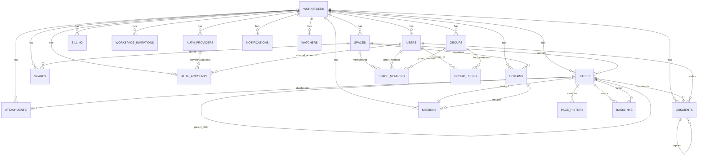

# Database Structure (Docmost)

This document summarizes the current server database model from migrations and generated Kysely types.

## Source of truth

- Schema evolution: `apps/server/src/database/migrations/*`
- Generated table/type map: `apps/server/src/database/types/db.d.ts`
- Extended interface (adds embeddings table): `apps/server/src/database/types/db.interface.ts`

---

## 1) High-level tenant model

The schema is **workspace-tenant scoped**:

- `workspaces` is the root tenant table.
- Most domain tables include `workspace_id` and often `space_id`.
- Content hierarchy is generally: `workspace -> spaces -> pages`.

---

## 2) Core tables by domain

### Identity & access

- `workspaces`
- `users`
- `groups`
- `group_users`
- `space_members`
- `workspace_invitations`
- `user_tokens`
- `user_mfa`
- `api_keys`
- `auth_providers`
- `auth_accounts`

### Content

- `spaces`
- `pages`
- `page_history`
- `comments`
- `attachments`
- `shares`
- `backlinks`

### Project/task management

- `domains`
- `missions`
- task-related columns on `pages` (`mission_id`, `task_status`, `important_level`, etc.)

### Operational/other

- `notifications`
- `watchers`
- `billing`
- `file_tasks`

---

## 3) Key relationships (FK intent)

- `users.workspace_id -> workspaces.id`
- `spaces.workspace_id -> workspaces.id`
- `pages.space_id -> spaces.id`
- `pages.workspace_id -> workspaces.id`
- `pages.parent_page_id -> pages.id` (page tree)
- `comments.page_id -> pages.id`
- `comments.parent_comment_id -> comments.id` (threading)
- `groups.workspace_id -> workspaces.id`
- `group_users.user_id -> users.id`
- `group_users.group_id -> groups.id`
- `space_members.space_id -> spaces.id`
- `space_members.user_id -> users.id` (nullable)
- `space_members.group_id -> groups.id` (nullable)
- `attachments.workspace_id -> workspaces.id`
- `attachments.space_id -> spaces.id` (nullable)
- `attachments.page_id -> pages.id` (nullable)
- `shares.workspace_id -> workspaces.id`
- `shares.space_id -> spaces.id`
- `shares.page_id -> pages.id` (nullable)
- `page_history.page_id -> pages.id`
- `notifications.user_id -> users.id`
- `notifications.page_id -> pages.id` (nullable)
- `notifications.space_id -> spaces.id` (nullable)
- `notifications.comment_id -> comments.id` (nullable)
- `watchers.user_id -> users.id`
- `watchers.space_id -> spaces.id`
- `watchers.page_id -> pages.id` (nullable)
- `domains.space_id -> spaces.id`
- `domains.workspace_id -> workspaces.id`
- `missions.domain_id -> domains.id`
- `missions.workspace_id -> workspaces.id`
- `pages.mission_id -> missions.id` (nullable)

> Notes:
> - Many links are configured with `onDelete('cascade')` in migrations.
> - Some actor columns use `onDelete('set null')` to preserve history while allowing user deletion.

---

## 4) Uniqueness and constraints highlights

- `workspaces`: unique hostname/custom-domain.
- `users`: unique (`email`, `workspace_id`).
- `spaces`: unique (`slug`, `workspace_id`).
- `pages`: unique `slug_id`.
- `space_members`: unique (`space_id`, `user_id`) and unique (`space_id`, `group_id`).
- `space_members`: check constraint enforcing exactly one of `user_id` or `group_id`.

---

## 5) Search/collaboration columns

- `pages.tsv` and `attachments.tsv`: search vectors/text indexing support.
- `pages.ydoc` (bytea): collaborative editor state storage.

---

## 6) Mermaid ER diagram (conceptual)

---

## 7) Table list from generated DB type

The generated `DB` type currently includes:

- `apiKeys`
- `attachments`
- `authAccounts`
- `authProviders`
- `backlinks`
- `billing`
- `comments`
- `domains`
- `fileTasks`
- `groups`
- `groupUsers`
- `missions`
- `notifications`
- `pageHistory`
- `pages`
- `shares`
- `spaceMembers`
- `spaces`
- `userMfa`
- `users`
- `userTokens`
- `watchers`
- `workspaceInvitations`
- `workspaces`

Additionally, `DbInterface` extends `DB` with `pageEmbeddings`.
